> ---
> **REPOSITORY PROMULGATION HEADER — EP-FOUNDATION-V1-M3 (2026-08-18) · do not remove**
> **REPOSITORY_PROMULGATION_STATUS:** PROMULGATED
> **DOCUMENT_AUTHORITY_CLASS:** PLAN_TARGET
> **ORIGINAL_SOURCE_VERSION:** PR-0 tree ed18736a (2026-07-12; authored 2026-07-07 at f975533d, Briefing #7)
> **ORIGINAL_SOURCE_ANCHOR:** PR-0 document tree (owner-supplied package; PR-0 header retained below as history)
> **FOUNDATION_V1_RUNTIME_ANCHOR:** `de80664a6d2f6ce9312b4bcc6e27c0ea4eba4e68` (tree `0174a5c5b2e74c80b904d035b4f8ddc10abbbd69`, post-M2A, 2026-08-17)
> **CURRENT_CANONICAL_PRECEDENCE:** where this document conflicts with the current canonical runtime state, `docs/architecture/current-state.md` and `docs/architecture/foundation-v1-freeze.md` prevail; merged executable source, migrations and executing tests prevail over every document.
> **PROMULGATED_BY:** EP-FOUNDATION-V1-M3-CANONICAL-FREEZE-AND-PR0-D9-V2 (owner decision D11B=APPROVED_AS_PLAN_TARGET)
> **PROMULGATION_PR:** branch `docs/foundation-v1-m3-canonical-freeze` (PR number recorded in `docs/architecture/foundation-v1-freeze.md`; the merge commit is recorded only in the external post-merge mission record)
> **HISTORICAL_BODY_PRESERVED:** YES (byte-identical below this header, incl. the PR-0 header)
> **SOURCE_SHA256:** `a03e8d0621d4372a1adba3c04a5181b9a745afc0b336ad7e6c6050754fb98f80` (owner-supplied source bytes, verified against the 43-entry corpus ledger; see `docs/architecture/d9-promulgation-manifest.md`)
> **NOTES:** PLAN TARGET (D11b). Body byte-preserved (large-document policy: no rewrite). KNOWN-STALE FAMILIES IN THE BODY, all superseded at the Foundation V1 anchor — read them as the July 2026 snapshot: (a) F1–F6 marked "pendente / até o fix" → F1, F3, F4, F5, F6 and C-2 are CORRECTED (PRs #118/#119/#120/#123) and F2 is CLOSED as an evidence-granularity residual (not a runtime defect); (b) the pre-M1 hard-deny floor ("3 tool validation classes + 3 hard_denied beta tokens", default-deny betas, `capability_planned`/`typed_unknown` 403s) → SUPERSEDED by the M1 native contract (ADR-021 Accepted): only provider-hosted computer-use is hard-denied, unknown/unresolved betas and non-computer tools are forwarded and observed; (c) EP-11 framed as "add the deny audit event / external deadline" → SUPERSEDED by ADR-032/EP-11 (the local deny was REMOVED, provider truth preserved); (d) `dispatch_status`/G-17 "coupled to F3" → realized by the P0.3-A durable dispatch layer (migration 0029) and P0.3-C run idempotency (0030) in a different shape; (e) D9 "pendente" → executed by M3; (f) migration/test/route counts and `arquivo:linha` anchors → current counts live in `docs/architecture/current-state.md`. Statements consistent with the anchor and still true: no UI exists; Phase 5 ask/sandbox/enforce primitives are NOT implemented (recommendation vs applied is honest over HTTP); no branch protection; hash-only capture.
> ---

> ---
> **CABEÇALHO DE RE-ANCORAGEM — PR-0 (2026-07-12) · não remover**
> **STATUS:** VISÃO-ALVO CANÔNICA — o manual de execução (specs densas §21; F1–F6 §23)
> **BASE DECLARADA PELO DOCUMENTO:** base f975533d (2026-07-07/10) — anterior ao #118 · **CÓDIGO NO MOMENTO DA PROMOÇÃO:** `ed18736a` (main, pós-#118, 2026-07-11)
> **REGIDO POR:** `docs/architecture/GOVAI-MAPA-MESTRE-DESENVOLVIMENTO_ed18736a.md` (v1.1) — em conflito de ESTADO ou ORDEM, o Mapa vence; em conflito com o CÓDIGO, o código vence (regra §0 do Mapa).
> **ÂNCORAS `arquivo:linha`:** re-verificar na fonte antes de qualquer uso (o código evolui; este cabeçalho não re-valida âncoras).
> **NOTAS DE PROMOÇÃO:** F5/F6 do §23 = CONCLUÍDO (#118); âncoras em dlp.ts/baseline-detectors.ts/run-orchestrator.ts MUDARAM — re-ancorar antes de citar.
> **ORIGEM:** handoff to-chat/
> ---

# GOVAI — MANUAL DE EXECUÇÃO (consolidação total: produto + engenharia + operação)

**Base:** `f975533d122afab251742c9459a12acc095dd8fb`. **Autor:** Fable 5 / Claude Code, 2026-07-07. **Briefing:** #7 (final, rev2).
**Relação com o plano-mestre:** este manual **EXPANDE** `to-chat/GOVAI-MASTER-PLAN-APPLICATION-FABLE5_f975533d_20260707.md` — não o reescreve. O que lá está excepcional (o contrato do Cap. 3 com os 19 pares (base,level) e o inventário de 140 rotas; os 7 planos; o vocabulário de honestidade; o roadmap F0–F9; os anexos) permanece NORMATIVO e é referenciado como `[MP Cap. N]`. Este manual adiciona o que o briefing #7 pediu: o banco de dados completo, a config, os pacotes, os testes-como-contrato, as categorias premium (threat model, onboarding, DR, SLAs, governança da própria GovAI, API pública, schema evolution), as specs densas dos módulos novos, os 11 EPs em formato implementável, os F1–F6 re-ancorados, o fechamento das 8 lacunas da auditoria crítica — e a correção das 10 falsas lacunas (Gap Register §1).
**Regras herdadas:** código vence docs; vocabulário de status em cada capacidade; fontes tipadas (Source Register); campos sob F1–F6 = `[CONTRATO CORRIGIDO — PENDENTE]`.
**Outputs irmãos:** `GOVAI-DOC-CATALOG-…` (Fase A), `GOVAI-SOURCE-REGISTER-…`, `GOVAI-GAP-REGISTER-…`, `GOVAI-IMPLEMENTATION-QUEUE-…` (a fila P0–P3).

---

# 1. Visão do produto

**GovAI AI Trust Layer** — a camada que torna o uso corporativo de IA controlável, auditável e produtor-de-evidência sem destruir a experiência provider-native. Posicionamento, doutrinas (7), personas (7 com motivo de compra), regra de UX (compliance invisível) e disciplina de claims: **[MP Cap. 1]** — normativo e inalterado.

**A consolidação standalone + integration-native (critérios 8/9 do briefing):**
- **Standalone (clientes SEM stack de governança):** GovAI é o plano de controle inteiro — gateway governado drop-in, política própria (alvo: Policy Studio §21.1), evidência selada própria (cadeia HMAC + outbox + sealer, tudo `[IMPLEMENTADO]`), cockpit próprio (`/v1/evidence/*`), fila de revisão própria (alvo: §21.2), relatórios próprios (alvo: Evidence Package). Status HONESTO hoje: standalone é `[ALVO DOCUMENTADO]` — a política só muda por SQL; o que o materializa é N1+EP-2+gestão de chaves ([MP Cap. 1.3]).
- **Integrada (clientes COM Purview/OneTrust/ServiceNow/SIEM/cloud-governance):** GovAI vira a camada de evidência/normalização — ingere sinais externos como evidência CLASSIFICADA POR PROVENIÊNCIA (nunca acima da primária), exporta para SIEM/GRC, e correlaciona (alvo: Connector Framework §21.4; hoje só o export OTel do operador existe). A matriz de responsabilidade nativo-vs-connector já está normatizada em `[DOC] regulatory/16-shared-responsibility-model.md`.
- **Comercial (do doc fundador 01, `[LOCAL]`):** o fosso declarado é "única plataforma com âncora regulatória brasileira" — ICP-Brasil signing + 17 frameworks + Operator Workspace governado + entry-level BR (doc 05: Starter R$4.9k/mês, Business R$19.8k/mês, Enterprise R$60–300k/mês). ⚠ Disciplina de claims: ICP-Brasil/TSA são `[ALVO]` (`chain_anchor_id` reservado desde a migração 0001; `evidence_strength` hoje é `hmac_internal`); nenhum material afirma o fosso como presente — afirma a DIREÇÃO e o que já é verificável (cadeia HMAC + completude monitorada).

**O que um agente implementa a partir daqui:** nada — mas TODO texto voltado a usuário/mercado passa pelo portão de claims ([MP Cap. 1.5] + `[MIRROR] claims-policy.md`).

# 2. Arquitetura-alvo (a doutrina, agora completa)

Os 7 planos com visão×estado×lacuna: **[MP Cap. 2]**. Este manual ADICIONA os documentos de doutrina que o plano-mestre não tinha lido (falsas lacunas FL-1..FL-6 corrigidas):
- **ADR-019 (provider identity)**: `providerId: string` no boundary do kernel/registry; eventos preservam unions literais até uma nova versão de evento validada contra registry; unknown-provider fail-safe. ⇒ regra prática JÁ APLICÁVEL: nenhum código novo deve estreitar provider além do que os eventos v4 exigem; o 3º provedor entra pelo registry, não por union nova.
- **spec-v2.1 (kernel + bridge hardening)**: os invariantes não-negociáveis (10), o fluxo (kernel→pre-capture→`prepared`→`dispatching`→fetch FORA de transação→finalize→seal), os estados de dispatch (`prepared|dispatching|completed|failed|failed_before_dispatch|unknown_after_dispatch|reconciled`), idempotency capability por provedor, streaming state-machine, minimização de metadados, posture strict/best_effort (risco primeiro, tier segundo), test-matrix. **Status vs código:** outbox/chain-state/refs/funções/sealer/completude = `[IMPLEMENTADO]` (0025/0026/0027 + EP-006/008); `dispatch_status` em `provider_invocations` = `[ALVO DOCUMENTADO]` (G-17 — implementar JUNTO do F3, mesma fronteira); posture strict end-to-end = `[FUNDACIONAL]` (coluna existe; resolvePosture não).
- **shadow-ai-privacy + agentic-action-governance (futures)**: princípios fixados (metadata-first/atestação; intended-action-hash/least-privilege/rollback) — R2+; a Workroom já implementa o precursor agentic (intended_action_hash + SoD).
- **threat-model**: §17 deste manual.
- **Decisão D9 (versionar a doutrina)** continua aberta e é o item documental nº 1 (fecha 3 referências quebradas no código).

# 3. Arquitetura implementada (o mapa de componentes e os dois caminhos)

```
                          ┌─────────────────────── clientes ───────────────────────┐
                          │  SDKs nativos (baseURL) · curl · futura SPA apps/ui     │
                          └───────────────┬─────────────────────────────────────────┘
                                          │ x-govai-api-key | Bearer
┌──────────────────────────────── apps/api (Fastify 5, Node 24) ────────────────────────────────┐
│ helmet+CORS+rate-limit(100/min) → authenticateApiKey → AuthIdentity{org,tier,mode,roles}      │
│                                                                                                │
│  PATH-B (proxy nativo)                    PATH-A (orquestrado)         LEITURA/GOVERNO         │
│  /governed/{anthropic,openai}/*           POST /v1/runs                /v1/evidence/*          │
│  /passthrough/{anthropic,openai}/*        (tx: runs+policy_decisions+  /v1/audit-events        │
│   ├ tool-classifier → block?               provider_invocations;       /v1/capabilities        │
│   ├ dlpScan(baseline) → escalate           dlpPreScan(config org) →    /v1/workrooms* (12 ops) │
│   ├ resolveGovernance (matriz)             deny|redact[F5]|detect)     /v1/regulatory/* (108)  │
│   ├ 403 só toolBlock|blocked               governed core COMPARTILHADO /v1/admin/* (3+2×501)   │
│   └ forward byte-perfeito (+SSE)                com o path-B           /health                 │
│              │ evento PassthroughInvoked v4 (emit)                                             │
│              ▼                                                                                 │
│  AuditBridge (best_effort, ALS identity) ──► govai.audit_capture_outbox (hash-only payload)    │
│  runs/workroom/admin/regulatory ──────────► auditAppend → govai.audit_append_locked (HMAC)     │
└────────────┬───────────────────────────────────────────────┬──────────────────────────────────┘
             │ OTel (drops/captures, gauges govai_evidence_*) │
             ▼                                                ▼
   otel-collector → Prometheus → Grafana (OPERADOR)   apps/audit-sealer (deploy próprio):
                                                      org-discovery(enumerator URL, INV-1) →
                                                      claim → auditAppend → mark_sealed
```
- **Dois caminhos de execução** com o MESMO core governado (`handleAnthropicGovernedMessages` é chamado pelo `/governed/*` E pelo `/v1/runs` governed — `[CODE] handle-messages.ts:1-7`); a diferença é transacional (path-A persiste runs/decisions/invocations) e de DLP (§8).
- **Quatro cadeias HMAC por org** (`auth|run|policy|admin`); rotas diretas evidenciam via outbox→sealer; rotas transacionais via append direto.
- **Boot**: fail-closed em produção (DevKMS/KMS_DEV_SEED/planned-exec → BootError; probe KMS; DATABASE_URL obrigatório) — `[CODE] server.ts:48-72; config:109-130`.
- Inventário completo de rotas/pacotes/apps: **[MP Cap. 3]** (140 pontos HTTP; 13 pacotes; 2 apps).

**O que um agente implementa a partir daqui:** use este diagrama para SITUAR qualquer mudança: toda superfície nova de execução/ingestão DEVE entrar pelos dois funis (matriz de governança + evidência via bridge/append) — é o invariante do ADR-018 ("no plane may bypass Kernel or Evidence Plane").
# 4. Banco de dados (dicionário completo — 27 migrações, 55 tabelas, 3 views, ~25 funções)

Fonte: `[CODE] apps/api/src/db/migrations/0001..0028` (sem 0006) + `infra/postgres/bootstrap.sql`. Runner: `apps/api/src/db/migrate.ts` (roda como admin; app roda como `govai_app`).

## 4.1 Papéis de banco (bootstrap.sql — o alicerce do isolamento)
| Role | Definição | Função |
|---|---|---|
| `govai_audit_writer` | NOINHERIT, sem LOGIN, **owner do schema govai** (:8,:57) | dono dos objetos; o migrate faz SET ROLE para criar; políticas de INSERT em audit |
| `govai_app` | NOINHERIT LOGIN (senha via GUC de sessão no bootstrap :45-51) | a aplicação; TUDO sob RLS FORCE + `app.org_id` |
| `govai_audit_sealer` | NOINHERIT NOLOGIN (:24) | o sealer; só claim/mark via SECURITY DEFINER |
| `govai_evidence_enumerator` | NOINHERIT NOLOGIN até provisionado (:61-82); lifecycle 5-estados no runner (provision/deprovision GUC + sweep) | INV-1: SÓ `SELECT (id) ON govai.orgs` — enumera, nunca lê evidência |

**INV-1 (invariante de isolamento):** nenhuma identidade única de DB detém enumerar+ler; visão cross-org = acumulação de N leituras single-org na aplicação (`[CODE] evidence-operator.ts:1-23`).

## 4.2 Dicionário por domínio (Nome · Finalidade · Colunas-chave · Proteções · Quem escreve/lê)

### A. Identidade & Tenancy (0005, 0008, 0010, 0011)
| Tabela | Finalidade | Colunas-chave | Proteções | Escreve / Lê |
|---|---|---|---|---|
| `orgs` | o tenant | `id, name, created_at` + **`tier`** (`starter\|business\|enterprise\|regulated`) e **`operational_mode`** (`production\|pilot\|dev\|test`) adicionados na 0008 (defaults starter/pilot) | RLS FORCE; SELECT app pela própria org; INSERT só writer; **NENHUMA rota muta** (plano do operador) | operador-SQL / app via `org_tier_lookup()` SECURITY DEFINER (0008:49) |
| `api_keys` | credencial da plataforma | `prefix PK, hash(argon2id), org_id, user_id, status(active\|revoked), roles[]` (0010) + CHECK de roles canônicos | lookup via `api_key_lookup_v2()` SECURITY DEFINER (0010:64; v1 aposentada na 0011) | CLI break-glass / auth pipeline |
| `dlp_baseline_config` | ação por detector por org | `(org_id, detector) PK, detector∈{cpf,cnpj,email,phone_br}, action∈{detect,redact,deny}` | RLS app select/insert/update | **hoje só SQL** (o CRUD é o 501 → N1) / `dlpPreScan` (path-A APENAS) |

### B. Execução path-A (0002, 0014)
| Tabela | Finalidade | Colunas-chave | Notas |
|---|---|---|---|
| `runs` | unidade central (ADR-001) | `id, org_id, workspace_id, actor_user_id, provider, model, mode(governed\|passthrough\|shadow), status(queued\|running\|completed\|failed\|denied\|awaiting_approval), risk_level(low..critical), metadata jsonb` + colunas workroom da 0014 (`workroom_id, workroom_task_id, created_by_participant_id, approval_policy_id, workroom_governance_mode`) | `shadow` RESERVADO (rota rejeita); RLS app select/insert/update por org |
| `provider_invocations` | a chamada real ao provedor | `run_id FK, provider, native_endpoint, native_method, native_request_hash, native_response_hash NULL, streaming, usage_json, latency_ms, status_code, provider_request_id, error_class` | ⚠ SEM `dispatch_status` (spec-v2.1 §7 = G-17); INSERT-only pela app |
| `policy_decisions` | decisão de política por run | `run_id FK, decision(allow\|deny\|mutate\|ask), policy_version_id bytea, reasons jsonb, mutations, framework_refs` | INSERT-only; a trilha do path-A que o path-B NÃO tem (→ EP-5) |

### C. Governança & DLP (0003, 0004, 0007)
| Tabela | Finalidade | Notas |
|---|---|---|
| `capability_overrides` | override por org da matriz capability×facet | consumida por `GET /v1/capabilities` |
| `dlp_detectors_custom` | detectores custom por org | `[FUNDACIONAL]` — o CRUD é o 501 (`admin-dlp.ts`) |
| `dlp_findings` | achados persistidos do path-A | `run_id, detector_id, detector_kind, count, action` — herda a inflação F6 até o fix |
| `org_beta_overrides` | overrides de beta-token por org | append-only (triggers no_delete/no_truncate); unique ativo por (org, token) |

### D. Credenciais de provedor (0009)
`provider_credentials`: envelope KMS (`encrypted_key, dek_wrapped, key_id, key_version`), `status(active\|revoked)`, unique ativo por (org, provider); append-only com revogação (no_delete/no_truncate); TODO set/revoke emite evento na cadeia `admin`. Plaintext NUNCA sai (`[CODE] admin-provider-credentials.ts:9-14`).

### E. Cadeia de auditoria (0001) — o coração
| Objeto | Detalhe |
|---|---|
| `audit_events` | `id, org_id, chain_id, sequence_number` (UNIQUE chain+seq), `event_type/version, subject_type/id, occurred_at, payload_hash, payload_ref→audit_event_payloads, redaction_metadata, previous_hmac, hmac, canonical_hash, canonical_bytes` (defesa-em-profundidade: bytes canônicos GUARDADOS), `key_id/version, chain_anchor_id NULL` (RESERVADO p/ TSA/Merkle/ICP), `evidence_strength∈{hmac_internal,dev_signed,external_anchor,customer_signed,icp_brasil_tsa}` |
| `audit_event_payloads` | payload cifrado envelope (`encrypted_payload, dek_wrapped, key_id/version`), `status∈{active,crypto_shredded,tombstoned}` — **crypto-shred (LGPD art.18) é primitivo de DB desde o dia 1** (`audit_event_payload_crypto_shred()` :402); a rota é o 501 |
| Imutabilidade | triggers no_update/no_delete/no_truncate em ambas; UPDATE de payload restrito ao shred (:218-270) |
| `audit_append_locked()` | SECURITY DEFINER (:278): advisory lock por cadeia (`chainLockKey`), valida previous_hmac, insere evento+payload atomicamente — chamada por `auditAppend` (`[CODE] core-audit/append.ts:55,:144`) |

### F. Workroom (0012–0015)
| Tabela | Chave |
|---|---|
| `workroom_policy_profiles` | perfil de política da sala (`governance_mode` default, `default_provider_surface`, `max_risk_without_approval`) |
| `workrooms` | sala; **`governance_mode` IMUTÁVEL por trigger** (0012:103) — `governance_active\|audit_only` decidido na criação |
| `agent_profiles` | identidade de agente (participante máquina) |
| `workroom_participants` | humanos/agentes com `role`(`human_owner\|human_approver\|…`); UNIQUE ativo por humano e por agente; **soft-remove only** (trigger :199) |
| `workroom_turns` | numeração de turnos ligada a `audit_events` (advisory lock + unique); imutável |
| `workroom_messages` / `workroom_tasks` / `workroom_evidence_artifacts` | transcript cifrado (linha guarda `content_ref`+`payload_hash`); tasks com `risk_class`+`requires_approval`; artefatos com os 11 `artifact_kind` — todos imutáveis |
| `workroom_approval_requests` / `_decisions` | o precursor agentic: `intended_action_hash`, `intended_action_payload_id` (cifrado), `expires_at`, `consumed_run_id/at`, `required_approver_count`; **guarded_update** (0015:132) restringe transições; **SoD por trigger** (0015:216) — quem pediu não decide |

### G. Regulatório (0016–0024) — 29 tabelas, um padrão
Registries com `scope∈{tenant,system}` (linhas system são globais read-only), cursor composto, evento na cadeia `policy` a cada mutação, e workflows com **guarded_update + SoD + block_after_terminal por TRIGGER** (0023:332-564; 0024:400-635 — a máquina de estados é imposta no BANCO, não só no serviço): sources(+versions+relationships), controls(+source_links+**framework_mappings** ← a semente do Crosswalk), ai_systems, providers, models(+versions+system_links), agents(+versions+capability_bindings com unique versionado), use_cases(+asset_links com 4 uniques parciais+reviews), risk_methods, risk_classifications(+factors), reclassification_triggers, high_risk_reviews(+evidence+assignments+decisions, one-active-per-classification, one-final), prohibited_use_policies, prohibited_use_cases(+evidence+determinations, one-final).

### H. Evidence plane (0025–0028) — a espinha do Plano 3
| Objeto | Detalhe |
|---|---|
| `audit_capture_chain_state` | `chain_id PK, last_captured_seq, last_sealed_capture_seq` com CHECK sealed≤captured — o contador de contiguidade |
| `audit_capture_outbox` | write-ahead durável: `capture_id UNIQUE, chain_id+capture_seq UNIQUE, event_* frozen, payload_hash, payload_encrypted NULL` (hash-only hoje), `posture(strict\|best_effort), status(captured\|sealing\|sealed\|failed)` com CHECKs de consistência terminal, `capture_integrity_tag/alg`, attempts, `last_error≤200`; **CHECK anti-payload-cru** no redaction_metadata (bloqueia chaves prompt/response/raw_*) |
| `audit_event_capture_refs` | mapeamento lateral capture↔audit_event (sem FK estrito — integridade via funções) |
| Funções SECURITY DEFINER | `audit_capture_insert_locked` (0026 = idempotência ADR-028: reuso quando TUDO idêntico exceto redaction_metadata — o "content anchor"; 17 colunas de divergência), `claim_for_seal` (sealer-only, próximo contíguo), `mark_sealed` (verifica seq+ref, avança chain_state), `mark_failed`, + guards de tabela |
| Views 0027 (`security_invoker`) | `evidence_capture_completeness` (EC-1.a), `evidence_chain_backlog` (EC-1.b), `evidence_provider_without_audit` (EC-3a/EC-4 — "expected empty") — GRANT só a `govai_app` |
| 0028 | política do enumerator (INV-1: `SELECT (id)` em orgs, `USING true` SÓ ali) |

## 4.3 ERD (Mermaid — o esqueleto; regulatório colapsado por família)

```mermaid
erDiagram
  orgs ||--o{ api_keys : has
  orgs ||--o{ provider_credentials : has
  orgs ||--o{ dlp_baseline_config : configures
  orgs ||--o{ capability_overrides : overrides
  orgs ||--o{ org_beta_overrides : allows
  runs ||--o{ provider_invocations : makes
  runs ||--o{ policy_decisions : decided_by
  runs ||--o{ dlp_findings : yields
  workrooms ||--o{ workroom_participants : has
  workrooms ||--o{ workroom_turns : logs
  workroom_policy_profiles ||--o{ workrooms : governs
  workroom_turns ||--o{ workroom_messages : contains
  workroom_turns ||--o{ workroom_tasks : contains
  workroom_turns ||--o{ workroom_evidence_artifacts : contains
  workrooms ||--o{ workroom_approval_requests : queues
  workroom_approval_requests ||--o{ workroom_approval_decisions : decided_by
  workroom_approval_requests }o--|| runs : consumed_by
  runs }o--|| workrooms : owned_by
  audit_events }o--|| audit_event_payloads : payload_ref
  audit_capture_outbox }o--|| audit_capture_chain_state : sequenced_by
  audit_capture_outbox ||--|| audit_event_capture_refs : sealed_as
  audit_event_capture_refs }o--|| audit_events : maps_to
  provider_invocations ||..o| audit_events : "EC-4 espera terminal run.*"
  regulatory_sources ||--o{ regulatory_source_versions : versioned
  regulatory_controls ||--o{ regulatory_control_framework_mappings : mapped
  regulatory_risk_classifications ||--o{ regulatory_high_risk_reviews : triggers
  regulatory_prohibited_use_cases ||--o{ regulatory_prohibited_use_determinations : determined
```


## 4.4 Política de evolução de schema (§5.7 do briefing — a regra da casa, extraída da prática real)
1. **Migração numerada sequencial** `NNNN_snake_name.sql` em `apps/api/src/db/migrations/` (o buraco 0006 prova: número consumido não se reusa). Idempotente (`IF NOT EXISTS`/DO-blocks com duplicate_object) — a suíte `bootstrap-idempotent.test.ts` cobra.
2. **Aditiva por default**: colunas novas NULL/default (ex.: 0008, 0014); NUNCA rewrite de tabela de evidência.
3. **Imutáveis não se alteram** — audit/outbox/turns/messages mudam por NOVOS objetos (o padrão 0026: CREATE OR REPLACE da FUNÇÃO, tabela intocada) ou por versão de evento.
4. **Role-discipline**: objetos criados sob `SET ROLE govai_audit_writer`; roles NUNCA em migração comum (bootstrap only — spec-v2.1 §5.1); grants mínimos explícitos; RLS FORCE + policies app/writer em toda tabela nova com org_id.
5. **Eventos**: `schema_version` literal no Zod (v4 atual); mudar campo = nova versão + regra de idempotência revisada (o precedente 0026: redaction_metadata é OBSERVACIONAL e ficou FORA da âncora de idempotência — qualquer campo novo decide DE QUAL LADO da âncora fica).
6. **Rollback**: não há down-migrations — rollback = migração corretiva para frente (padrão do repo); por isso toda migração passa por revisão adversarial antes do merge (processo A2/dois-leitores).
7. **Depreciação**: caminho legado preservado com comentário e teste (ex.: `ANTHROPIC_BETA_ALLOWLIST` legado vazio; `api_key_lookup` v1 aposentada com migração própria 0011).

**O que um agente implementa a partir daqui:** qualquer tabela nova segue o template: uuid PK + org_id + RLS FORCE + policies (app select/insert[/update restrito], writer select) + triggers de imutabilidade se for evidência + evento de auditoria na mutação + entrada neste dicionário.
# 5. APIs (o contrato público de cliente — §5.9)

**Inventário completo com linhas:** [MP Cap. 3.7 + 13.1] (140 pontos HTTP re-derivados). Este manual fixa o CONTRATO DE CLIENTE (o que se documenta para quem integra):

## 5.1 O drop-in SDK (a promessa provider-native)
O cliente troca UMA linha — o baseURL — e mantém o SDK oficial:
```ts
// Anthropic (governado): new Anthropic({ baseURL: 'https://<govai>/governed/anthropic', apiKey: '<GOVAI_KEY>' })
// OpenAI  (governado): new OpenAI({ baseURL: 'https://<govai>/governed/openai',  apiKey: '<GOVAI_KEY>' })
// Observado (sem matriz): .../passthrough/{anthropic|openai}
```
- A chave enviada é a **da GovAI** (`x-govai-api-key` ou `Authorization: Bearer`); a chave do PROVEDOR nunca transita no cliente — é resolvida server-side (tenant credential → env em dev/test) e injetada no forward (`[CODE] handle-messages.ts:151-165`).
- Corpo e resposta são byte-perfeitos; SSE repassado; headers hop-by-hop e de auth destripados (tabela viva em `[DOC] contracts/passthrough-headers.md` — corrigir os pontos DESATUALIZADOS marcados no catálogo).
- **Headers de resposta GovAI (o canal por-request):** `x-govai-capability-level`, `x-govai-effective-risk-class`, `x-govai-enforcement-decision`. 403 governado = `{error:'governed_blocked', reason, governance}`.
- **Superfícies suportadas** (registry = fonte): Anthropic messages(+stream)/count_tokens/models/files; OpenAI responses(+stream)/chat.completions(+stream)/models(+delete)/embeddings/files/vector_stores(+deletes). Beta-tokens Anthropic sob política (9 entradas; `hard_denied` → 403 + evento `passthrough.beta_denied`).
- ⚠ **OpenAI Files `purpose=assistants`**: warning de depreciação até 2026-08-26; deny 403 `purpose_deprecated_post_sunset` depois (`[CODE] files-purpose-validator.ts`) — comunicar a clientes JÁ (EP-11 adiciona o evento de auditoria do deny).

## 5.2 As superfícies de leitura/governo (resumo de contrato)
`GET /v1/capabilities` (matriz resolvida por org) · `GET /v1/evidence/summary|gaps` (cockpit; janela ≤1a; cursor offset ≤500) · `GET /v1/audit-events` (metadados+hashes hex, NUNCA payload; keyset ≤200) · `POST /v1/runs` (governed|passthrough; `denied→403`, `failed→502`, `shadow→400`) · `/v1/workrooms*` (12 ops; dois eixos de autorização) · `/v1/regulatory/*` (108 ops; escrita admin|dpo) · `/v1/admin/provider-credentials*` (admin; plaintext one-way). Convenções: bigint-string, hex, ISO-8601, envelope `{error,…}`, cross-tenant=404, 3 paginações ([MP Cap. 3.3]).

# 6. Governança runtime (o fato verificado — §10 do briefing)

NORMATIVO: [MP Cap. 3.4] — o conjunto exato e a alcançabilidade, re-verificados par a par (e settled em 6 leituras + a concordância final do Opus). O resumo operacional inegociável:
- 6 capacidades `policy_governed`, TODAS base A (2 Anthropic + 4 OpenAI). Toda base B/C é `passthrough_audited` (incl. `file_search_tool` base B — o erro clássico nº 4). Passthrough fixa `observe`.
- PII forte: A→C máx → `ask` (ENCAMINHA). C→D e E inalcançáveis no governado. `E→blocked` = dead code (F2a).
- 403 reais: validação de ferramenta (computer_use/code_execution/typed_unknown — qualquer modo), matriz bash(D)+starter+produção, beta hard_denied, autorização.
- dev/test→observe incondicional; pilot relaxa 1 (nunca bloqueia por matriz); side_effects/preconditions DESCARTADOS (`resolve-governance.ts:153-158`).
- Item pós-rev43 #2 (dono): NOMEAR em doc de arquitetura que enforcement acima de `blocked` é observacional — risco de representação para comprador (o /v1/runs hard-deny por config de DLP é real; o /governed não bloqueia por PII).

# 7. Evidência & auditoria (o pipeline completo)

**Cadeia:** `auditAppend` → `audit_append_locked` (advisory lock por cadeia; HMAC encadeado por org+categoria; canonical JSON com bytes GUARDADOS; verify em `core-audit/verify.ts`). 4 categorias: `auth|run|policy|admin`.
**Captura (rotas diretas):** hook de identidade ALS (`server.ts:170`; F4 pendente) → `makeAuditBridge` → projeção AuditBridgeCapturePayloadV1 → `captureAuditEvent` → `audit_capture_insert_locked` (idempotente por conteúdo, ADR-028/0026) → outbox `captured` (payload **hash-only**; posture `best_effort` NUNCA falha a request; quedas tipadas + contadas em `govai_audit_bridge_drops_total`).
**Selagem (apps/audit-sealer):** descoberta de orgs pelo BANCO como enumerator (INV-1; CSV só override; fail-loud `discoveryProbed`) → claim contíguo por cadeia → `auditAppend` com event-id determinístico (uuid5) → `mark_sealed` avança chain_state. Backoff, stale-recovery, health-file, métricas OTel próprias. Deployable: bundle esbuild + Docker non-root + compose profile.
**Completude (EC-\*):** [MP Cap. 8.1] — EC-1/2/3seal/3drop/4 + coverage_ratio com paridade coverage↔gaps; EC-5 DEFERIDO; EC-6 sempre `pending` (→ EP-7); honestidades embutidas no contrato (excluded[]/note/bound).
**Evento v4 (`PassthroughInvoked`):** campos e Regras 1–8 ([MP Cap. 3.6]); `stream_outcome∈{complete,upstream_error,client_disconnect}` (EP-008C); `credential_source` e `enforcement_decision`-no-bloqueio `[CONTRATO CORRIGIDO — PENDENTE]` (F1/F2).
**Grau de evidência:** `evidence_strength='hmac_internal'` hoje; `chain_anchor_id` reservado; TSA/Merkle/ICP-Brasil = EP-ANCHOR (R2/R3) — claims gated.

# 8. DLP & classificação de dados sensíveis

**Baseline (enforcement-driving):** `cpf`/`cnpj` (pii_strong; validação checksum real — CPF mod-11; CNPJ numérico E alfanumérico IN RFB 2.229/2024, uppercase-only) + `email`/`phone_br` (pii_standard). RE2 (sem catastrophic backtracking; exige Node 24 pela ABI).
**Os DOIS regimes (a assimetria — [MP Cap. 3.5]):** path-A lê `dlp_baseline_config` e pode `deny` (403) ou `redact` (**QUEBRADO — F5**); path-B detecta→escala com `action:'warn'` literal, ignora a config, nunca redige. Convergência deny-primeiro = decisão Q2 → EP-10.
**Camada rica SD1/SD2A (advisory):** `scanSensitiveData` com taxonomia+proveniência+`match_hash`+preview redigido (NUNCA plaintext); famílias: segredos/credenciais, CNJ (court), financeiro, saúde, custom (`[CODE] packages/dlp-br/src/index.ts`). É a matéria-prima do RT-bridge (uma classe não-baseline policy-bound = deliverable Foundation) e do Policy Studio.
**F5/F6:** o fix funde intervalos sobrepostos antes de redigir + dedup por span nas contagens; até lá NENHUMA narrativa de "redigido" e contagens rotuladas "podem sobrepor".

# 9. Policies (a superfície de política HOJE e o alvo)

**Hoje (tudo que é configurável, e por quem):**
| Controle | Onde | Quem muda | Trilha |
|---|---|---|---|
| `tier` / `operational_mode` | `orgs` (0008) | OPERADOR via SQL | ⚠ NENHUMA (lacuna: mutação sem evento) |
| Ação por detector | `dlp_baseline_config` | operador via SQL (CRUD=501) | nenhuma |
| Overrides de capability | `capability_overrides` | via serviço (admin) | evento |
| Beta overrides | `org_beta_overrides` | funções admin core-governance | evento; append-only |
| Perfil de sala | `workroom_policy_profiles` | criação da sala | evento lifecycle |
| Matriz de enforcement | CÓDIGO (`enforcement.ts`) | PR + ADR | git |
**Alvo:** Policy Studio (§21.1) — a config vira produto com versionamento/publish/rollback/auditoria; o tenant NUNCA muda tier/modo/hard-deny (regra de segurança R10); o operador ganha trilha selada para o que hoje é SQL mudo.

# 10. Review Queue — ver a spec densa §21.2 (o "ask" virar produto; decisão D7 pós-hoc vs retenção; o molde é `workroom-approvals`).

# 11. Workrooms (o que está implementado — forte — e o que falta)

Implementado `[fonte+teste]`: criação transacional (perfil + owner + evento), modo IMUTÁVEL pós-criação (trigger), participantes com soft-remove e uniques ativos, transcript/tasks/artefatos cifrados e imutáveis, turnos com advisory-lock, runs com matriz de modo (`defaulted|explicit|upgrade|override_approved|override_denied`), aprovações com intended_action_hash + expiry semântico read-time + SoD (trigger NO BANCO + checagem na rota) + consumo one-time + revogação, subviews evidence/audit com keyset. Faltas: GET participantes (EP-3), transcript-read (D1/EP-B5), notificações (entra com N2), agentes de verdade (agent_profiles é `[FUNDACIONAL]`).

# 12. Integrations (estado real vs alvo)

Hoje `[IMPLEMENTADO]`: export OTel/OTLP (métricas de bridge+gauges de evidência+sealer) → collector→Prometheus→Grafana (stack local completa em `infra/`); CORS de 1ª classe. **Não existe**: ingestão de terceiros, export SIEM/GRC, webhooks, ServiceNow/Jira/Slack. Alvo: Connector Framework (§21.4) com `ExternalEvidenceEvent` + proveniência (`PRIMARY_GOVAI > INGESTED_* > DERIVED > DECLARATIVE` — vocabulário JÁ existe em `sensitive-provenance.ts`) e a matriz de responsabilidade do `regulatory/16`.

# 13. Compliance mapping (o núcleo regulatório como produto)

- **R1–R9 implementados como CONTROLE FUNDACIONAL** (29 tabelas + 108 ops + máquinas de estado NO BANCO): registro de fontes/controles/sistemas/modelos/agentes/casos-de-uso, motor de classificação de risco (+`/evaluate` puro), workflows high-risk e prohibited-use com SoD. **Evidência de governança, NÃO enforcement de runtime** (Fase 5 = ligar DENIED ao gateway).
- **A taxonomia normativa** COVERED/PARTIAL/GAP/NEEDS_SOURCE_VERIFICATION vem de `regulatory/README`; os domínios de controle + evidências PR-R1..R6 de `regulatory/20`; readiness≠certificação de `regulatory/22`; setoriais 08/09/10; CNJ/Sinapses 25. O **Crosswalk (§21.5)** é o MOTOR sobre essa base: célula = requisito→controle→**query de evidência executável**→status; nunca parecer jurídico; nunca COVERED sem fonte.
- **Claims:** [MP Cap. 1.5] + `claims-policy.md`; o gate operacional (identificar capability→status→testes→escopo→limitação) entra no template de PR.
# 14. UI (o plano de UI corrigido pelo código + o fechamento das 8 lacunas da auditoria crítica)

**Ordem das fases (INALTERADA, por instrução):** **U1 Cockpit/evidência → U2 Workrooms → U3 Regulatório → U4 Admin/Playground**; as áreas novas (Policy Studio, Review Queue, Casos, Conectores, Crosswalk) entram nas fases F5–F8 DEPOIS do núcleo. Arquitetura (SPA apps/ui, sem BFF/SSR), design system "Ledger", vocabulário de honestidade, telas por persona: [MP Cap. 5–8] normativos. Este manual FECHA as 8 lacunas da auditoria crítica:

## 14.1 (Lacuna 7) A contagem honesta de esforço
**~25 telas ÚNICAS a construir + 1 template instanciado**: 15 base (acesso 1, evidência 4, workroom lista+detalhe-com-abas 2, playground 1, hub regulatório 1, simulador 1, admin 3, + template regulatório 1 CONSTRUÍDO uma vez e instanciado 17×2 por config) + ~9-10 das features novas (review 3, policy 4, casos 3, conectores 3, crosswalk 2 — com componentes compartilhados a contagem efetiva cai). O "68 nominais" mede navegação, não esforço; U3 é MECÂNICO (config por recurso), não 34 telas.

## 14.2 (Lacuna 2) i18n — decisão arquitetural
**DECISÃO `[recomendação forte]`: camada de chaves desde o commit 1; PT-BR como locale default e ÚNICO na fase 1.** Razões: (a) retrofit em ~25 telas densas é caro; (b) o produto tem vocação EN (auditores externos, multinacionais, EU AI Act — D11); (c) a "linguagem por persona" (regra 8 da honestidade) é uma DIMENSÃO do mesmo mecanismo: `t(key, {persona})` — a chave de status resolve fraseado por persona sem duplicar componentes. Implementação: `lib/i18n.ts` fino (sem framework pesado; um dicionário tipado `pt-BR.ts` com namespaces por domínio), TODA string de UI via chave (lint proíbe literal em JSX), `honesty.ts`/`vocab.ts` retornam CHAVES, não strings. Teste: o grep de vocabulário proibido (F5) roda sobre o dicionário — um único lugar.

## 14.3 (Lacuna 3) A matriz de invalidação de cache (mutação → query-keys)
Query-keys canônicos: `['evidence','summary',window]`, `['evidence','gaps',invariant,window]`, `['audit-events',chain]`, `['capabilities']`, `['workrooms']`, `['workroom',id]`, `['workroom',id,'runs'|'approvals'|'evidence'|'audit'|'participants']`, `['approval',id]`, `['credentials']`, `['reg',resource]`, `['reg',resource,id]`, `['me']`, `['review','items',status]`, `['policy','dlp'|'effective']`.
| Mutação | Invalida |
|---|---|
| POST workroom | `['workrooms']` |
| POST/DELETE participante | `['workroom',id,'participants']`, `['workroom',id]` |
| POST message/task | `['workroom',id,'evidence']`, `['workroom',id,'audit']` |
| POST workroom run | `['workroom',id,'runs']`, `['workroom',id,'approvals']` (consumo!), `['audit-events','run']` |
| POST approval | `['workroom',id,'approvals']` |
| POST decision / revoke | `['workroom',id,'approvals']`, `['approval',approvalId]`, `['workroom',id,'runs']` |
| POST /v1/runs | `['audit-events','run']`, `['evidence','summary',*]` (staleTime cobre; invalidação explícita só no playground) |
| POST/revoke credential | `['credentials']`, `['audit-events','admin']` |
| Mutação regulatória (qualquer) | `['reg',resource]`, `['reg',resource,id]`, `['audit-events','policy']` |
| PUT dlp-baseline / policy (N1) | `['policy','dlp']`, `['policy','effective']`, `['audit-events','admin']` |
| approve/deny review-item (N2) | `['review','items',*]`, `['review','item',id]`, cadeia `policy` |
Regra: 409 (corrida) → refetch da key afetada SEM invalidar a árvore; 401 → limpar TODO o cache (sessão caiu).

## 14.4 (Lacuna 4) Segurança do cliente (o perímetro completo)
- **CSP (servida pelo reverse proxy da UI):** `default-src 'self'; script-src 'self'; style-src 'self' 'unsafe-inline'; img-src 'self' data:; font-src 'self'; connect-src 'self'; frame-ancestors 'none'; base-uri 'self'; form-action 'self'; object-src 'none'` (same-origin atrás do proxy ⇒ `connect-src 'self'` basta; origem separada ⇒ adicionar o host da API explicitamente — nunca `*`).
- **A chave NUNCA entra em**: URL/query, localStorage/sessionStorage/cookie (fase 1), logs de console, telemetria, mensagens de erro renderizadas, breadcrumbs. O client HTTP centraliza o header e REDIGE a chave de qualquer serialização de erro (`redactKey(err)` obrigatório no interceptor). Sem Sentry/analytics de terceiros na fase 1.
- **Auto-lock por inatividade:** 15 min sem interação → a chave é zerada da memória → `/enter` (timer resetado por atividade; aviso 60s antes). Fechar o tab = sessão morta (garantia estrutural da fase 1).
- **Outros:** campo de chave `type=password` + `autocomplete=off`; clipboard de HashText só copia HASHES (nunca a chave); build sem source maps públicos em produção.

## 14.5 (Lacuna 5) Contract testing em RUNTIME (não só typecheck)
Camada nova no CI: **fixtures REAIS gravadas → validadas contra os Zod do `@govai/api-contract`**. Mecânica: (1) job `contract-fixtures` sobe a stack local (como o job integration), semeia o seed padrão, grava as respostas reais das rotas de U1 (`summary`, `gaps×5`, `audit-events×4`, `capabilities`) em `tests/contract/fixtures/*.json` com params usados; (2) teste `contract-validate` roda `schema.parse(fixture)` para cada — diverge ⇒ falha NO PR que mudou a rota OU o schema; (3) a UI usa as MESMAS fixtures no MSW (o mock nunca deriva do contrato imaginado). Expande por fase (U2: workrooms/approvals; N1/N2 nascem com fixture no PR do EP).
## 14.6 (Lacuna 6) A11y como REQUISITO
**Nível-alvo: WCAG 2.1 AA** (herdado do doc fundador 04 §11, que já o fixava — agora amarrado ao stack atual): axe-core no CI (job ui, zero violações sérias nas telas-âncora), navegação 100% teclado (Radix cobre foco/aria; testar tab-order das tabelas densas), `status nunca só por cor` (JÁ é regra da honestidade — reconhecida como requisito a11y), contraste AA na paleta Ledger (verificar os tons de badge outline), `aria-live` para toasts/refetch de 409, foco devolvido ao fechar modal/sheet, tabelas com caption/scope.
## 14.7 (Lacuna 8) A matriz tela×estado (as telas-âncora; padrão para as demais)
| Tela | Loading | Vazio (honesto) | Erro |
|---|---|---|---|
| Cockpit | skeleton de 6 tiles + anel | "Nenhuma captura nesta janela — amplie a janela ou verifique se há tráfego. (Vazio ≠ verificado: EC-6 segue pendente.)" | "Não foi possível carregar a evidência — tentar de novo" + status HTTP; NUNCA tiles zerados como se fossem dados |
| Gaps por invariante | skeleton 5 linhas | "Nenhuma lacuna de {invariante} nesta janela" (+ ec3drop: a ficha `observed:false` É o estado) | idem + manter o filtro |
| Cadeia | skeleton | "Nenhum evento nesta cadeia ainda" | idem |
| Workroom detalhe | skeleton por aba | Runs: "nenhum run nesta sala"; Aprovações: "nada pendente — decisões passadas ficam no histórico" | 404 → "sala não encontrada — ou fora da sua organização" |
| Fila de revisão (N2) | skeleton | "Fila limpa — nenhum item aguarda revisão" + última decisão | erro + retry |
| Policy Studio (N1) | skeleton do formulário | config default explicitada ("nenhuma regra própria; valem os defaults: detect") | erro SEM esconder a config vigente |
| Entrar | — | — | 401: "chave inválida"; 429: "limite atingido — aguarde"; rede: "API indisponível" |

## 14.8 (Lacuna 1) Wireframes ASCII das telas-âncora que faltavam
(Os mockups RENDERIZADOS ficam com o arquiteto, por disposição da auditoria; estes wireframes posicionais destravam implementação.)

**Workroom — detalhe (5 abas + banner):**
```
┌ GovAI ▸ Workrooms ▸ sala-x ──────────────────────────────────────────────┐
│ ⚠ MODO AUDIT_ONLY — banner permanente não-dismissível (se aplicável)     │
│ sala-x  ⬤ active   perfil: default   max_risk_sem_aprovação: C           │
│ [Visão geral][Runs][Aprovações][Evidência][Auditoria*]      *auditor/adm │
├──────────────────────────────────────────────────────────────────────────┤
│ (Runs)  [Executar ▾ governed|passthrough]                                 │
│ id      status      mode_relation        provider  risco  criado         │
│ run-1   completed   defaulted            anthropic A      10:22          │
│ run-2   denied      override_denied ⚠    anthropic —      10:31          │
│ run-3   completed   override_approved 🔗ap-7        D→ok  10:40          │
│                                    [Carregar mais (cursor composto)]     │
└──────────────────────────────────────────────────────────────────────────┘
```
**Fila de aprovações (SoD explícito):**
```
┌ Aprovações — sala-x ────────────────────────────────────────────────────┐
│ [Pendentes(2)] [Concedidas] [Negadas/Expiradas/Revogadas]               │
│ ap-9  passthrough-override  pedente: ana   expira em 02:11  risco C     │
│   hash da ação: ab12…f9 ⧉    [Decidir]  ← DESABILITADO p/ ana:          │
│   "separação de deveres: quem pediu não decide"                          │
│ ap-7  consumida ✓ run-3 🔗   decidida por bob: "ok, escopo revisto"      │
└──────────────────────────────────────────────────────────────────────────┘
Modal Decidir: [Conceder][Negar (razão OBRIGATÓRIA)] + consequência:
"conceder autoriza EXATAMENTE a ação com hash ab12…f9, uma única vez"
```
**Policy Studio — regras de dados sensíveis (N1):**
```
┌ Política ▸ Dados sensíveis ─────────────────────────────────────────────┐
│ ⬤ production · tier starter    [Simular decisão]                        │
│ detector   classe        ação                       efeito real          │
│ CPF        pii_strong    [detect|redact†|deny ▾]    /v1/runs: aplica     │
│ CNPJ       pii_strong    [deny ▾]                   /governed: detecta e │
│ email      pii_standard  [detect ▾]                 escala (não bloqueia)│
│ phone_br   pii_standard  [detect ▾]                 † redact pendente F5 │
│ HARD-DENY FLOOR (imutável): computer_use · code_execution ·              │
│ typed_unknown · 3 beta-tokens hard_denied            [publicar rascunho] │
│ Publicações: v3 (ativa, por bob 07/07) · v2 · v1     [rollback p/ v2]    │
└──────────────────────────────────────────────────────────────────────────┘
```
**Evidence Package — compor caso (N3):**
```
┌ Casos ▸ novo ───────────────────────────────────────────────────────────┐
│ 1. Janela  [2026-07-01 → 2026-07-07]   2. Filtros [cadeia: run ▾]        │
│ 3. Itens: ☑ 14 eventos  ☑ 2 decisões  ☑ 1 aprovação  ☐ gaps EC-1        │
│ Prévia do manifesto: 17 itens · hashes sha256 · ressalvas: EC-6 pending  │
│ [Gerar pacote (JSON)]  → "technical evidence bundle — não certificação"  │
└──────────────────────────────────────────────────────────────────────────┘
```
**Tela regulatória (o template ×17):**
```
┌ Regulatório ▸ high-risk-reviews ─── selo roxo: "registro de evidência —  │
│ não bloqueia execução" ──────────────────────────────────────────────────┤
│ [Nova revisão*]  filtro status ▾        *admin|dpo                       │
│ id    título              status     classificação  atualizado           │
│ hr-3  uso RH triagem      submitted  risk-c7 🔗      06/07               │
│ Detalhe: [draft→submitted→decided] timeline + evidência + assignments +  │
│ decisões (SoD; 1 final) + [submit][cancel]                               │
└──────────────────────────────────────────────────────────────────────────┘
```

**O que um agente implementa a partir daqui:** i18n desde o bootstrap (14.2); o interceptor com redactKey + auto-lock (14.4); a matriz 14.3 como tabela em `lib/api/invalidation.ts`; axe no job ui (14.6); as fixtures de contrato no primeiro PR de backend que a UI consumir (14.5); os estados da 14.7 como props obrigatórias do DataTable/StatCard.

# 15. Operação (deploy, runbooks consolidados, SLAs)

## 15.1 Deploy (o padrão por componente)
| Componente | Como | Fonte |
|---|---|---|
| Postgres 16 | compose `postgres` + `bootstrap.sql` (roles) + `migrate.ts` | infra/docker-compose.yml:2 |
| apps/api | hoje tsx (dev); ALVO: replicar o padrão esbuild do sealer (o Dockerfile do sealer "templates the API's future Dockerfile" — rev43) | — |
| apps/audit-sealer | bundle esbuild `node dist/bundle.mjs`, Docker non-root, compose `profiles:["sealer"]`, env própria (DATABASE_URL + ENUMERATOR_DATABASE_URL runtime) | Dockerfile; config.ts:85-95 |
| Observabilidade | compose.observability (collector 0.119.0+ em Apple Silicon, prometheus, grafana) | infra/ |
| UI (futura) | estático atrás do reverse proxy (same-origin `/app`) | [MP Cap. 11] |
## 15.2 Runbooks consolidados (o índice único — §5.11)
Existentes: `observability-local` (stack + validação zero-spend) · `user-e2e-local` (a jornada governada real + o fato do enforcement) · `kms-production` (AWS KMS + fail-closed + ciphertext file FORA do repo) · `db-roles-production` (roles/senhas/GUC) · `planned-capability-guard` · `canonical-reconstruction-fallback` (reconstrução canônica). **A escrever** (lacunas G-28/G-29): `backup-restore` (§18), `incident-response` (do threat-model §17: quem faz o quê em T2/T3/T4), `sealer-operations` (claim travado/stale/backlog — parcialmente coberto por ADR-023/024/025), `key-rotation` (HMAC + provider credentials + enumerator), `deploy-production` (ordem: migrate → api → sealer → collector; smoke: /health + summary + seal de 1 evento).
## 15.3 SLAs, performance e capacidade (§5.10 — hoje medível vs alvo)
- **Limites atuais:** rate 100/min global in-memory (G-07); pool pg max 10 default; sealer claim_batch 10 / max_in_flight 2 / idle 1s (config.ts:92-95); T_seal SLO 300s (config:53); janela default 86400s.
- **Gargalos conhecidos:** F3 (conexão retida durante fetch — o pior); rate-limit por-processo (multi-instância inconsistente); N+1 do cockpit (1×summary+k×gaps — aceitável pós-EP-1).
- **Orçamento de fricção (alvo da master-arch §10 — medir, não prometer):** passthrough p95<50ms; governed p95<100ms; DLP p95<250ms; strict seal p95<750ms (excluindo latência do provedor). **Benchmarks a criar:** harness de latência por caminho (com provedor mockado) no CI noturno; métrica de seal-lag já existe (EC-3.seal/T_seal).
- **Capacidade:** outbox é append+claim (índices por chain/status/seq); a pressão real é o sealer (single worker hoje — `AUDIT_SEALER_WORKER_ID`; escalar = mais workers com claim contíguo por cadeia, já seguro por design).

# 16. Segurança (a arquitetura em uma página)

Identidade: argon2id + prefixo + roles CHECK no banco + filtro defensivo. Tenancy: RLS FORCE em TUDO + `set_config('app.org_id')` transacional + cross-tenant=404. Roles de DB mínimos (4) + INV-1. Segredos: envelope KMS (provider creds, transcript, intended actions); DevKms fail-closed em prod; AWS KMS real; master seed só como ciphertext FORA do repo. Evidência: append-only por trigger + HMAC encadeado + canonical_bytes + idempotência por conteúdo. Rede: helmet, CORS com guarda, headers de auth destripados no forward, hop-by-hop filtrados. Ferramentas: validação bloqueante (3 classes) + beta hard_denied. Supply chain: pnpm lockfile; gitleaks no CI (unit job); SBOM `[ALVO — pré-regulated]`. Artefatos: `artifact-hygiene.md` (nunca zip cru; git archive; scan).

# 17. Threat model (T1–T10 ancorado no código — de `[MIRROR] security/threat-model.md`)

| T | Cenário | Controles EXISTENTES `[CODE]` | Lacunas |
|---|---|---|---|
| T1 | Bypass de evidência provider-native | bridge nas 4 rotas + `/v1/runs`; EC-4 "expected empty"; testes de wiring | teste "nenhuma rota nova sem bridge" como GATE genérico (entra no template de EP) |
| T2 | Adulteração do outbox pré-seal | conteúdo imutável (guards), CHECKs terminais, RLS FORCE, funções SECURITY DEFINER | `capture_integrity_tag` existe mas não é populado (posture strict) — EP futuro |
| T3 | Comprometimento do role sealer | NOLOGIN, claim contíguo estrito, chain-state guard, credencial própria | monitoramento de credencial; anchoring externo (EP-ANCHOR) limita o blast |
| T4 | Exfiltração de credencial de provedor | envelope KMS; plaintext one-way; testes plaintext-leak; strip de headers | rotação procedimental (runbook key-rotation) |
| T5 | Comprometimento de policy pack | N/A hoje (packs não existem) | assinatura+canary quando o Update Plane nascer (R2) |
| T6 | Envenenamento por conector | vocabulário de proveniência pronto; ingerido nunca sobrepõe primária (doutrina) | TODO o resto — threat model específico ANTES da ingestão (por isso export-first) |
| T7 | Overreach de privacidade (Shadow AI) | doutrina fixada (metadata-first/atestação) | implementação R2 |
| T8 | Abuso de aprovação (conluio/roubo) | SoD em TRIGGER + rota; hash da ação exata; expiry; one-time; trilha | analytics de aprovação suspeita (futuro) |
| T9 | Prompt injection / excessive agency | classificação de ferramenta com bloqueio; risk-class por tool; approval p/ override | enforcement além de bash/validação (Fase 5); sandbox real |
| T10 | Vazamento por artefato | artifact-hygiene + gitleaks CI + allowlist de fixtures | — |
**Pré-regulated (do §4 do doc):** backup/DR (§18), rotação HMAC, review externo, SBOM, rate-limit distribuído — todos no Gap Register (G-28/G-29).
**Resposta a incidentes (esqueleto mínimo):** classificar (evidência? credencial? isolamento?) → congelar (revogar chave/credencial; pausar sealer se integridade em dúvida) → provar (verify da cadeia; EC reports; export do recorte) → comunicar (claims-policy vale DOBRADO em incidente) → post-mortem com evento na cadeia `admin`.

# 18. Backup & disaster recovery (§5.8 — política proposta `[NOVO — PROPOSTO]`)

- **O que proteger (ordem):** (1) `audit_events`+`audit_event_payloads` (a evidência selada — perda = perda do produto); (2) `audit_capture_outbox`+chain_state+refs (evidência em trânsito); (3) o resto do schema (reconstituível em tese, mas trate como um só). KMS: as CMKs são do provedor (AWS) — o que se protege é o ciphertext do master seed (fora do repo) e os wraps (`dek_wrapped` nas tabelas — já dentro do backup do banco).
- **Mecânica:** base backup + WAL archiving (PITR) contínuo; RPO-alvo ≤5min (WAL), RTO-alvo ≤1h (restore ensaiado); retenção ≥ a maior janela regulatória do tenant (config por tier — Regulated mais longa).
- **Prova de restauração (o diferencial de um produto de evidência):** o restore drill mensal TERMINA com `verify` da cadeia (core-audit/verify) + EC reports no ambiente restaurado — "backup íntegro" = cadeia verifica, não "pg_restore não deu erro". Registrar o drill como evento na cadeia `admin`.
- **Perda parcial de payload:** payload cifrado perdido ≠ cadeia quebrada (o evento guarda `payload_hash` + canonical_bytes) — a trilha de integridade sobrevive; o conteúdo não. Documentar essa semântica no export forense (N3 já carrega hashes + instruções).
- **Chaves:** rotação de HMAC key_version é suportada pelo schema (key_id/version por evento) mas SEM runbook — escrever antes de Regulated; enumerator/sealer/app com rotação independente (URLs separadas já garantem).

# 19. Onboarding dev/agente (do zero ao primeiro PR — §5.6)

1. **Toolchain:** Node **24.15.0** (`nvm use 24.15.0` — re2 ABI quebra em Node 22: NODE_MODULE_VERSION 137 vs 127), pnpm 10.x, Docker OU Colima (Apple Silicon: collector OTLP ≥0.119.0), git.
2. **Clone + install:** `pnpm install` (workspace: 13 packages + 2 apps + tests).
3. **Ambiente:** copiar `.env.example`; dev usa DevKms (`GOVAI_KMS_PROVIDER=dev` default) — NUNCA em produção (BootError); `DATABASE_URL` para o postgres do compose.
4. **Banco:** `docker compose -f infra/docker-compose.yml up postgres` (bootstrap.sql roda no init: roles+schema) → `pnpm --filter @govai/api migrate` (0001..0028).
5. **Gates rápidos:** `pnpm typecheck && pnpm lint && pnpm test` (unit-only por default — `tests/integration/**` FORA do include sem o gate).
6. **Integração:** `GOVAI_INTEGRATION=1 pnpm test:integration` (sobe contra o postgres local; 65 arquivos; flake conhecido: contenção de testcontainers em full-run — arquivo isolado passa).
7. **Live (opcional, gasta chave):** `GOVAI_LIVE_TESTS=1` + chaves reais; user-e2e zero-spend: seguir `docs/runbooks/user-e2e-local.md` (o runbook também ensina O FATO do enforcement).
8. **Rodar:** `pnpm --filter @govai/api dev` → `GET /health` → criar org+chave (SQL + CLI break-glass `grant:api-key-role`) → `POST /v1/runs` hermético.
9. **Primeiro PR:** ler [MP Cap. 3] + este manual §4/§6; convenções: sem comentário-ruído, migração idempotente, evento de auditoria em mutação, teste de RLS (cross-tenant 404), gitleaks-allowlist para fixtures com shape de segredo; gates verdes; A2 (sem strings proibidas no commit); descrição com fonte tipada.
10. **Retomar contexto (agente):** ler `GOVAI-OPERATION-STATE-<mais recente>` no handoff + o trio de continuidade (ciente da defasagem) + este manual; verificar `git rev-parse HEAD` vs a base declarada da tarefa; NUNCA confiar em doc de estado sem confrontar o código (regra #1).

# 20. Roadmap executável

O roadmap normativo é [MP Cap. 9] (F0–F9 mapeado a Foundation/R2/R3 + pacotes comerciais + matriz build/integrate). A **fila operacional item-a-item** está no output irmão `GOVAI-IMPLEMENTATION-QUEUE-…` (P0–P3 com schema/endpoints/eventos/testes/dependências/riscos por item). Deltas deste manual sobre o plano-mestre: (i) EP-11 (sunset) ganha PRAZO EXTERNO 2026-08-26 → entra em F0/P0; (ii) EP-8 removido (já entregue — FL-8); (iii) G-17 (dispatch_status) acoplado ao F3; (iv) docs D8/D9 viram itens executáveis de F0.
# 21. Specs densas por módulo (a documentação premium — prioridade: N1 → N2 → N3 → N4 → N5)

Formato por módulo: Objetivo · Persona · User story · Estado atual · Schema SQL · Endpoints · Zod · Eventos · Autorização · Telas · Testes · Aceite · Ordem · Riscos. **Confirmado na fonte que NENHUM dos 5 existe** (grep vazio por rota/tabela).

## 21.1 ★ POLICY STUDIO (a tela que sustenta "standalone") — `[NOVO — PROPOSTO]`

**Objetivo:** dar ao tenant/operador controle sobre a própria governança SEM SQL — a peça que muda "standalone" de `[ALVO]` para entregue.
**Persona:** Owner/admin do tenant (regras de DLP, thresholds); OPERADOR da plataforma (tier/modo — superfície separada).
**User story:** "Como admin, configuro que CPF em produção seja negado no /v1/runs e vejo, ANTES de publicar, que no /governed ele continua sendo detectado-e-encaminhado — e publico com trilha."
**Estado atual:** `dlp_baseline_config` existe e é lida SÓ pelo path-A; sem CRUD (o `admin-dlp.ts` é 501); `tier`/`operational_mode` mutáveis só por SQL, sem trilha; a matriz de enforcement é código. Hard-deny floor = 3 validações de tool + beta hard_denied (imutável).

**Schema SQL novo:**
```sql
-- versionamento de política por org (publish/rollback com trilha)
CREATE TABLE govai.policy_versions (
  id uuid PRIMARY KEY, org_id uuid NOT NULL,
  version int NOT NULL,                     -- monotônico por org
  status text NOT NULL CHECK (status IN ('draft','active','superseded')),
  document jsonb NOT NULL,                   -- o snapshot completo da política
  created_by_user_id uuid NOT NULL, created_at timestamptz NOT NULL DEFAULT now(),
  activated_at timestamptz NULL,
  UNIQUE (org_id, version)
);
-- só UMA ativa por org (índice parcial)
CREATE UNIQUE INDEX policy_versions_one_active ON govai.policy_versions(org_id) WHERE status='active';
-- RLS FORCE; app select/insert; a ativação é SECURITY DEFINER (supersede a anterior atomicamente)
-- dlp_baseline_config ganha CRUD via serviço (a fonte da verdade continua a tabela; policy_versions é o log auditável)
```
Regra: `operational_mode`/`tier` NÃO entram em `policy_versions` (plano do operador); ganham `govai.operator_actions` (evento na cadeia `admin`) numa superfície separada — hoje mudam sem trilha (lacuna real a fechar).

**Endpoints:**
```
GET  /v1/policy/effective            → matriz efetiva resolvida da org (READ-ONLY, derivada de enforcement.ts + config + overrides)
GET  /v1/policy/dlp-baseline         → config atual por detector
PUT  /v1/policy/dlp-baseline         → {detector, action}[] (admin) — cria draft, não ativa
POST /v1/policy/simulate             → {surface, capability, sample_input, tier?, mode?} → decisão hipotética (compute puro, ZERO persistência, ZERO forward) — espelha /regulatory/.../evaluate
POST /v1/policy/versions/:id/publish → ativa um draft (admin); supersede a ativa; evento
POST /v1/policy/versions/:id/rollback→ reativa uma superseded como nova versão; evento
GET  /v1/policy/versions             → histórico
```
**Zod (simulate — o coração honesto):** req `{surface:'governed'|'passthrough'|'runs', capability:string, sample_input:string, tier?:Tier, operational_mode?:OperationalMode}` → resp `{base_risk_class, effective_risk_class, risk_escalation_reasons[], enforcement_decision, http_effect:'forward'|'403', honest_label:string}` — reusa `resolveGovernance` puro; o `honest_label` vem de `honesty.ts`.
**Eventos (cadeia `policy`/`admin`):** `policy.version_published`, `policy.version_rolled_back`, `policy.dlp_config_changed`, `operator.org_mode_changed` (o que hoje não existe).
**Autorização:** leitura qualquer chave da org; escrita de DLP/publish `admin`; tier/modo SÓ operador (nunca via esta API). ★ **R10 (regra de segurança):** o hard-deny floor é READ-ONLY na UI e no backend; nenhuma versão de política pode removê-lo; `simulate` deixa o efeito real ÓBVIO antes de publicar.
**Telas:** §14.8 (Política ▸ Dados sensíveis + effective + simulate + versões/rollback).
**Testes:** simulate = resolveGovernance (property: nunca 403 onde a matriz não 403); publish supersede atômico (1 ativa); rollback cria versão nova; DLP change reflete no path-A e é auditado; tenant NÃO consegue mudar tier/modo (403); hard-deny imutável.
**Aceite:** um admin configura deny de CPF e publica; `/v1/runs` passa a negar; `/governed` continua detectando; a mudança está na cadeia; rollback restaura; simulate previu tudo.
**Ordem:** F6. **Riscos:** R10 (arma); versionamento precisa ser atômico (índice parcial + SECURITY DEFINER); a divergência path-A/path-B tem que ser EXIBIDA (senão o admin acha que "deny" bloqueia em todo lugar).

## 21.2 ★ REVIEW QUEUE (o "ask" virar produto) — `[NOVO — PROPOSTO]`

**Objetivo:** transformar `ask` (hoje encaminha sem reter) num work-item revisável com decisão na cadeia.
**Persona:** Owner/gestor e DPO (revisores); qualquer usuário (gera o item).
**User story:** "Como DPO, vejo os itens que a governança marcou para revisão, decido com separação de deveres, e a decisão entra na trilha — sem ter travado o usuário."
**Estado atual:** `ask` só anota header + `dlp_decisions.action:'warn'`; nada é enfileirado. O mecanismo de aprovação da workroom (`workroom_approval_*` + SoD trigger + expiry read-time + one-time) é o MOLDE a generalizar para fora da sala.
**★ Decisão D7 (embutida):** **pós-hoc primeiro** (o item é criado COM o evento; o usuário não espera; a UI é honesta: "revisão a posteriori — a request foi encaminhada"); **retenção como opt-in por org** depois (segura a request; muda o SLA — a master-arch §10 já isenta approval de promessa de latência). Recomendação mantida.

**Schema SQL:**
```sql
CREATE TABLE govai.review_items (
  id uuid PRIMARY KEY, org_id uuid NOT NULL,
  source text NOT NULL CHECK (source IN ('governed','runs','workroom','connector')),
  trigger_reason text NOT NULL,             -- ex.: 'dlp:cpf:pii_strong', 'effective_risk:C'
  subject_audit_event_id uuid NULL,         -- link à evidência que gerou (a cadeia)
  status text NOT NULL CHECK (status IN ('open','approved','denied','expired','info_requested')),
  mode text NOT NULL CHECK (mode IN ('post_hoc','retained')) DEFAULT 'post_hoc',
  requested_by_user_id uuid NULL, expires_at timestamptz NULL,
  created_at timestamptz NOT NULL DEFAULT now()
);
CREATE TABLE govai.review_decisions (
  id uuid PRIMARY KEY, review_item_id uuid NOT NULL, org_id uuid NOT NULL,
  decider_user_id uuid NOT NULL, decision text NOT NULL CHECK (decision IN ('approve','deny','request_info')),
  reason text NULL,                          -- OBRIGATÓRIO em deny (CHECK)
  decided_at timestamptz NOT NULL DEFAULT now(),
  CHECK (decision <> 'deny' OR reason IS NOT NULL)
);
-- RLS FORCE; SoD via trigger (decider_user_id <> requested_by_user_id) — o padrão de 0015; one-final por item
```
**Endpoints:** `GET /v1/review-items?status=` · `GET /v1/review-items/:id` (+ evidência linkada) · `POST /v1/review-items/:id/approve|deny|request-info` (deny exige razão; SoD) · `GET /v1/review-items/:id/evidence`.
**Eventos (cadeia `policy`):** `review.item_created`, `review.decided` (com decisão+razão), `review.expired`.
**Autorização:** ler qualquer chave da org; decidir = role de revisor (dpo/admin) E ≠ requester (SoD). Expiry semântico em leitura (o padrão de `workroom-approvals.ts:209-217`).
**Telas:** §14.8 (fila + item + config pós-hoc/retenção). **Integração** (F8): ServiceNow/Jira/Slack/Teams como NOTIFICAÇÃO (via Connector Framework) — nunca como fonte da decisão.
**Testes:** item criado no `ask`; SoD (requester não decide → 403); deny sem razão → 400; expiry read-time; decisão na cadeia; pós-hoc não adiciona latência (o item nasce do evento já emitido).
**Aceite:** um CPF em /v1/runs (org com deny→não; org sem deny→ask) gera item; o DPO aprova/nega; a decisão está na trilha; o usuário nunca travou (modo pós-hoc).
**Ordem:** F5. **Riscos:** R11 (retenção como gargalo — por isso opt-in); não confundir com aprovação de workroom (aquela é intra-sala, esta é org-wide); notificação externa não pode virar dependência de decisão.

## 21.3 EVIDENCE PACKAGE / CASE EXPORT — `[NOVO — PROPOSTO]`

**Objetivo:** o pacote auditável por incidente/caso — o que diferencia de um DLP genérico.
**Persona:** Jurídico/Compliance, Auditor.
**Estado atual:** nenhuma rota de relatório; a primitiva "Exportar esta consulta (JSON)" da UI é o degrau 0.
**Schema SQL:**
```sql
CREATE TABLE govai.evidence_packages (
  id uuid PRIMARY KEY, org_id uuid NOT NULL,
  title text NOT NULL, window_start timestamptz NOT NULL, window_end timestamptz NOT NULL,
  filters jsonb NOT NULL,                    -- cadeia, subject, invariante...
  manifest jsonb NOT NULL,                   -- itens + hashes + ressalvas, congelado na composição
  manifest_hash bytea NOT NULL,              -- sha256 do manifesto (o pacote é ele mesmo evidência)
  created_by_user_id uuid NOT NULL, created_at timestamptz NOT NULL DEFAULT now()
);
-- imutável (triggers no_modify/no_truncate — padrão de evidência); RLS FORCE
```
**Endpoints:** `POST /v1/evidence-packages` (compõe: janela+filtros+itens explícitos; congela manifesto+hash) · `GET /v1/evidence-packages/:id` (manifesto) · `GET /v1/evidence-packages/:id/export?format=json|pdf` (bundle + instruções de verificação de integridade).
**Eventos (cadeia `admin`):** `evidence_package.created`, `evidence_package.exported` (quem/quando — o acesso à evidência é ele mesmo auditado).
**Conteúdo do bundle:** timeline; metadados de request; policy decisions; sinais de DLP (com a ressalva F6 até o fix); audit_event_ids + payload_hashes + HMACs; status de selagem (EC-1); decisões de revisor (N2); **as ressalvas DENTRO** (EC-6 pending, bounds do EC-3.drop); autodenominação "technical evidence bundle — not certification"; instruções: "verifique cada hash contra a cadeia via GET /v1/audit-events; a integridade é HMAC interna (evidence_strength=hmac_internal) — não há âncora externa neste build".
**Autorização:** compor/exportar = auditor/admin/dpo; RLS por org. **Testes:** manifesto congela (recompor com mesma janela = mesmo hash); export não vaza payload (só hashes); ressalvas presentes; acesso auditado. **Ordem:** F7. **Riscos:** R12 (lido como certificação — o vocabulário e as instruções blindam); NUNCA incluir conteúdo cru.

## 21.4 CONNECTOR FRAMEWORK (ingestão + export) — `[NOVO — PROPOSTO]`

**Objetivo:** a doutrina "integrada" — ingerir sinais de terceiros como evidência classificada por proveniência e exportar para SIEM/GRC.
**Persona:** CISO/Segurança (export SIEM); DPO (correlação).
**Estado atual:** só o export OTel do operador; vocabulário de proveniência PRONTO (`sensitive-provenance.ts`); matriz de responsabilidade em `regulatory/16`.
**Contrato `ExternalEvidenceEvent`:** `source_system, source_event_id, occurred_at, actor, tenant, provider, ai_system, action, classification, policy_decision, raw_ref, normalized_ref, trust_level, evidence_hash`. **Classificação de evidência (a regra de ouro):** `PRIMARY_GOVAI > INGESTED_PROVIDER > INGESTED_GRC > INGESTED_DLP > DERIVED > DECLARATIVE` — **ingerido NUNCA sobrepõe primária** (imposto no schema + na leitura).
**Schema SQL:**
```sql
CREATE TABLE govai.connectors (
  id uuid PRIMARY KEY, org_id uuid NOT NULL, kind text NOT NULL, -- 'siem_splunk','purview','servicenow'...
  direction text NOT NULL CHECK (direction IN ('ingest','export','both')),
  config jsonb NOT NULL, credential_ref uuid NULL,   -- envelope KMS, nunca plaintext
  status text NOT NULL CHECK (status IN ('active','disabled')), created_at timestamptz DEFAULT now()
);
CREATE TABLE govai.external_evidence_events (
  id uuid PRIMARY KEY, org_id uuid NOT NULL, connector_id uuid NOT NULL,
  source_system text NOT NULL, source_event_id text NOT NULL,
  trust_level text NOT NULL CHECK (trust_level IN ('PRIMARY_GOVAI','INGESTED_PROVIDER','INGESTED_GRC','INGESTED_DLP','DERIVED','DECLARATIVE')),
  occurred_at timestamptz NOT NULL, payload_ref uuid NULL, evidence_hash bytea NOT NULL,
  ingested_at timestamptz NOT NULL DEFAULT now(),
  UNIQUE (connector_id, source_event_id)      -- idempotência de ingestão
  CHECK (trust_level <> 'PRIMARY_GOVAI')       -- ingestão NUNCA se declara primária
);
```
**Endpoints:** ingest `POST /v1/connectors/:id/events` (idempotente, metadata-first — conteúdo só com política+atestação, doutrina shadow-ai); config `GET/POST/PATCH /v1/connectors`; export = SINK ASSÍNCRONO (outbox→destino via worker, como o sealer), NÃO query síncrona. **Ordem interna: export SIEM primeiro** (menor risco, valor CISO); ingestão depois (traz o threat model T6).
**Eventos:** `connector.configured`, `connector.export_batch` (cadeia `admin`); ingestão gera evento com trust_level explícito.
**Autorização:** config = admin; ingest = credencial de conector dedicada (não a chave de tenant). **Testes:** idempotência de ingestão; PRIMARY_GOVAI rejeitado na ingestão; export não perde eventos (outbox); credencial nunca em plaintext. **Ordem:** F8. **Riscos:** R13 (conector envenenando — export-first evita, threat model antes de ingestão); a matriz de `regulatory/16` define quem responde pelo quê.

## 21.5 COMPLIANCE CROSSWALK — `[NOVO — PROPOSTO]` (base documental PRONTA — FL-9)

**Objetivo:** Requirement→Control→Evidence→Status→Gap→Remediation→Owner — a "prova de cobertura".
**Persona:** Jurídico/Compliance, DPO.
**Estado atual:** a taxonomia (COVERED/PARTIAL/GAP/NEEDS_SOURCE_VERIFICATION) e os domínios estão em `regulatory/README` + `/20`; `controls`+`framework_mappings` ligam controle↔framework no schema. Falta a ponta Evidence (controle→query executável) e o motor de status.
**Schema SQL:**
```sql
CREATE TABLE govai.crosswalk_cells (
  id uuid PRIMARY KEY, org_id uuid NOT NULL,
  framework text NOT NULL,                    -- 'LGPD','NIST_AI_RMF','ISO_42001','EU_AI_ACT'
  requirement_key text NOT NULL,
  control_id uuid NULL REFERENCES govai.regulatory_controls(id),
  evidence_query text NULL,                   -- a CONSULTA que sustenta a célula (auditável, não opinião)
  status text NOT NULL CHECK (status IN ('COVERED','PARTIAL','GAP','NEEDS_SOURCE_VERIFICATION')) DEFAULT 'NEEDS_SOURCE_VERIFICATION',
  gap_note text NULL, remediation text NULL, owner_user_id uuid NULL,
  UNIQUE (org_id, framework, requirement_key)
);
```
**Endpoints:** `GET /v1/crosswalk?framework=` (matriz computada — status derivado da existência de evidência viva) · `PUT /v1/crosswalk/mappings` (curadoria; admin/dpo). **Regra:** NUNCA `COVERED` sem `evidence_query` que retorna linhas; NUNCA parecer jurídico; default honesto `NEEDS_SOURCE_VERIFICATION`.
**Eventos:** `crosswalk.mapping_changed` (cadeia `policy`). **Telas:** matriz + detalhe de requisito (§6.3 do plano-mestre). **Testes:** COVERED exige query com resultado; mudança de status auditada; célula referencia evidência real. **Ordem:** F8. **Riscos:** R12 (certificação); a query de evidência é o antídoto (a célula é verificável).

# 22. Os 11 EPs de fundação (formato implementável — §7 do briefing)

Detalhe completo (arquivos/schema/rotas/eventos/testes/gates/STOP) no output `GOVAI-IMPLEMENTATION-QUEUE-…`. Resumo com correções deste manual:
1. **EP-1 rate-limit por chave/org** — keyGenerator por prefixo; Redis (REDIS_URL já existe) p/ multi-instância. STOP: não mexer no limiter global sem métrica de baseline.
2. **EP-2 `GET /v1/me`** — serializa AuthIdentity (`{org_id, roles, tier, operational_mode, api_key_prefix}`); zero query nova.
3. **EP-3 `GET /v1/workrooms/:id/participants`** — select RLS-scoped; destrava SoD-UX.
4. **EP-4 chave→JWT** — `jwt.ts` já valida (alg allowlist); cookie httpOnly; `API_CORS_CREDENTIALS`/`JWT_*` já na config.
5. **EP-5 feed por-request** — decisão D4 (retenção/PII) ANTES; join `provider_invocations`+`policy_decisions` OU projeção legível no capture. STOP: não persistir conteúdo cru.
6. **EP-6 `@govai/api-contract`** — extrair Zod inline; começa por evidence/audit/capabilities; habilita 14.5.
7. **EP-7 verificação EC-6** — verificador persistido + `POST /v1/evidence/verify` bounded; o gauge `chain_verification_ok` já espera o resultado.
8. **EP-8 ~~evidence gauges boot wiring~~** — ★ **JÁ ENTREGUE (FL-8; PR #115)** — removido da fila.
9. **EP-9 audit hardening SQL-side** — reavaliar `digest()` (pgcrypto JÁ é dependência de fato — a justificativa do veto é contrafactual, G-14); corrigir baseline-decisions.
10. **EP-10 DLP single-source-of-truth** — convergir path-A/path-B (Q2 deny-primeiro); um só detector-run; alimenta N1.
11. **EP-11 OpenAI Files pós-sunset** — evento de auditoria do deny `purpose_deprecated_post_sunset` + teste da virada 2026-08-26. ★ **PRAZO EXTERNO: 7 semanas** → P0.
+ **EP-DISPATCH-STATE (G-17)** — os estados `prepared/dispatching/unknown_after_dispatch` da spec-v2.1 §7, acoplado ao F3 (mesma fronteira de transação).
+ **F1–F6** (§9) como pré-condição.

**O que um agente implementa a partir daqui:** pega UM EP/módulo, lê a spec densa + a linha correspondente no Implementation Queue, e implementa com schema+rotas+eventos+testes já definidos — sem re-decidir arquitetura.
# 23. F1–F6 re-ancorados no código atual (§9 do briefing)

Todos re-lidos NESTA sessão em `f975533d`. Campos tocados = `[CONTRATO CORRIGIDO — PENDENTE]` (descrevo o ALVO).

## F1 — `credential_source` hardcoded (Alto)
- **Linha atual:** 14 literais `'tenant_provider_credential'` — governed Anthropic `handle-messages.ts:283,351,416`; OpenAI `handle-chat-completions.ts:185,244,308` + `handle-responses.ts:256,315,379`; passthrough Anthropic `register-passthrough.ts:407,482` + OpenAI `:467,543`.
- **Atual:** o evento selado afirma origem de tenant mesmo quando a credencial veio de env (`provider-credentials.ts:161-166`, dev/test).
- **Alvo:** `credential_source` = valor de retorno do resolvedor (`tenant_provider_credential|platform_env_key|hermetic_placeholder|none`) propagado ao evento; o schema hoje só exige string≥1 (`passthrough-invoked.ts:141`).
- **Teste de aceitação:** dev sem credencial de tenant → evento com `platform_env_key`; produção com tenant → `tenant_provider_credential`; o teste de `governed-*` afirma o campo, não o literal.
- **Risco se não corrigir:** evidência de conformidade com proveniência de credencial FALSA.

## F2 — ramo `blocked` morto + rótulo errado no bloqueio (Alto)
- **(a) dead code:** `enforcement.ts:66` (`E→blocked`) inalcançável (F2a — nenhuma base D/E, escalação máx D só por bash; prova [MP Cap. 3.4]).
- **(b) rótulo:** `handle-messages.ts:278` grava `enforcement_decision:'blocked'` FIXO no caminho de bloqueio, enquanto `register-governed.ts:114-121` devolve ao cliente a decisão real; no tool-block o evento diz 'blocked' mas o gatilho foi validação.
- **Alvo:** o evento grava a decisão REAL da matriz + `block_trigger∈{tool_validation,enforcement_matrix}` + `block_reason`. A UI, até o fix, deriva o rótulo do 403/`body_forward_mode='blocked'`, não do `enforcement_decision`.
- **Teste:** tool-block emite `block_trigger='tool_validation'` + a decisão real (não 'blocked'); bash+starter emite `enforcement_matrix`+'blocked'.
- **Risco:** o evento diverge do corpo HTTP; auditoria lê "blocked" onde a matriz disse outra coisa.

## F3 — transação aberta durante o fetch upstream no `/v1/runs` (Alto/Médio) — ★ RE-ANCORADO
- **Linhas atuais (verificadas nesta sessão):** `run-orchestrator.ts:467` `const client = await deps.pool.connect()` → `:471` `await client.query('BEGIN')` → `:647` `result = await handleAnthropicGovernedMessages(...)` (o handler faz o **fetch upstream DENTRO da transação**) → `:999` `await client.query('COMMIT')` (o commit final do caminho governado; há commits intermediários em :551 [deny], :763/:824/:911 por ramo). O passthrough tem a MESMA forma (`:1090` connect → `:1094` BEGIN → `:1193` `forwardRaw` → `:1377` COMMIT).
- **Reforço:** `packages/provider-anthropic/src/passthrough/forward.ts` — **zero `AbortSignal`/`timeout`** (grep vazio) → retenção ILIMITADA no caminho não-stream.
- **`/health` estático** (`health.ts:4`) não toca o pool → liveness verde sob exaustão.
- **Alvo:** fechar a transação de ESCRITA antes do fetch (append em transação curta após a resposta, como as rotas diretas fazem — o padrão que a spec-v2.1 §3 formaliza: `prepared`→`dispatching`→fetch FORA da tx→finalize); dar `AbortSignal`+timeout ao `forwardRaw`; readiness real com `SELECT 1` ao pool. **Acoplar EP-DISPATCH-STATE (G-17):** os estados `prepared/dispatching/unknown_after_dispatch` em `provider_invocations` nascem deste mesmo fix.
- **Teste:** provedor lento (mock com delay) NÃO retém conexão do pool durante o fetch; timeout aborta; `/health` (ou `/ready`) reflete exaustão.
- **Risco:** exaustão do pool (max 10 default) sob provedor lento/pendurado; sem auto-restart (liveness cega). ★ **Nota de verificação (herdada da auditoria crítica):** o número EXATO do COMMIT final (:999) foi re-lido nesta sessão; se divergir no diff de implementação, o CLU re-ancora — a SUBSTÂNCIA (fetch dentro da tx sem timeout) é o que importa.

## F4 — identidade de request via `enterWith` → captura descartada (Médio)
- **Linha atual:** `request-identity-hook.ts:63` `requestIdentityAls.enterWith(identity)` (não `als.run`).
- **Atual:** se `getStore()` retornar `undefined` num caminho terminal, o bridge descarta como `missing_request_identity` (`audit-bridge.ts:29,131-133`) → perda de evidência. Bleed cross-request NÃO reproduzível (org vem do evento, não do ALS).
- **Alvo:** `als.run(identity, () => handler(...))` envolvendo o handler.
- **Teste:** um caminho terminal de stream ainda tem `getStore()` definido; nenhuma queda `missing_request_identity` no caminho feliz.
- **Risco:** perda silenciosa de evidência (contada em `govai_audit_bridge_drops_total`, mas é evidência que deveria existir).

## F5 — `redactFindings` corrompe e vaza PII em achados sobrepostos (Alto) — ★ O MAIS GRAVE, verificado LITERALMENTE
- **Linhas atuais:** `dlp.ts:87-94` — ordena por índice DECRESCENTE (`:88` `sort((a,b)=>b.index-a.index)`) e aplica `out.slice(0,f.index)+marcador+out.slice(f.index+f.length)` (`:91`) com índices do texto ORIGINAL sobre a string `out` que muda de tamanho, SEM fundir intervalos. `detectAllBaseline` (`baseline-detectors.ts:121-123`) concatena 4 detectores → mesmo span casado por 2+ (CPF nu casa CPF_RE `:14` e PHONE_BR_RE `:24`; email com local-part CPF casa os 3).
- **Atual:** para achados DISJUNTOS a redação direita→esquerda é correta; com SOBREPOSIÇÃO, o marcador aplicado depois "come" através do marcador anterior → texto corrompido E PII original sobrevivendo em claro (o modelo reproduziu: `"meu cpf 11144477735 ok"` → `"meu cpf [REDACTED:phone_br]pf] ok"`).
- **Escopo:** só `/v1/runs` com `action='redact'` (`run-orchestrator.ts:575`); `/governed/*` não redige (`handle-messages.ts:219-221`).
- **Alvo:** fundir intervalos `[index, index+length)` sobrepostos ANTES de redigir; reconstruir por varredura esquerda→direita com offset acumulado (ou pular posições já cobertas).
- **Teste:** CPF nu (casa cpf+phone) → UM marcador, zero PII sobrevivente; email-com-CPF → UM marcador; texto sem sobreposição inalterado.
- **Risco:** vazamento de PII em claro para o provedor externo, num produto de conformidade LGPD. ★ **Regra de produto:** NENHUMA tela/indicador afirma "PII redigida/protegida/removida" até este fix (grep de build proíbe).

## F6 — sobreposição infla contagens de evidência (Baixo)
- **Linhas atuais:** mesma raiz — `run-orchestrator.ts:540` `dlp_finding_count`, `:563` INSERT em `dlp_findings` por detector, `handle-messages.ts:236` `finding_classes` (Set de detectores — 2 detectores p/ 1 valor).
- **Alvo:** de-duplicar por span antes de contar/persistir (junto do F5).
- **Teste:** CPF nu conta 1 achado forte, não cpf+phone; `finding_classes` reflete o span, não os detectores.
- **Risco:** contagem de evidência super-conta; até o fix, a UI rotula "detecções (podem sobrepor)".

**O que um agente implementa a partir daqui:** F5+F6 juntos (mesma raiz — a fusão de intervalos resolve os dois); F1+F2 juntos (ambos são campos do evento derivados-de-fato — o alvo de ambos é "derive do resolvedor/da matriz, não literal"); F3 com EP-DISPATCH-STATE; F4 é uma linha (`enterWith`→`als.run`). Cada fix nasce com o teste de aceitação acima e a UI liga o campo apagando a flag `contractFixed.*`.

# 24. Governança da própria GovAI (§5.12 — "quem governa a GovAI?")

A pergunta do briefing, respondida com o código + a matriz de `regulatory/16`:

| Ação | Quem pode | Controle HOJE `[CODE]` | Trilha | Lacuna |
|---|---|---|---|---|
| Admin de credenciais de provedor | role `admin` (`requireAdmin`) | plaintext one-way; RLS | evento cadeia `admin` | — |
| Escrita regulatória | `admin`/`data_protection_officer` | `requireWriteRole` | evento cadeia `policy` | — |
| Decisão de aprovação (workroom) | participante `human_owner`/`human_approver` ≠ requester | SoD em TRIGGER + rota | cadeia | — |
| Acesso a evidência (tenant) | qualquer chave da org | RLS (só a própria org); "o auditor É o tenant" | leitura não gera evento hoje | acesso a evidência não é auditado (o N3 corrige p/ export) |
| Mudar tier/modo/DLP config | OPERADOR via SQL | RLS/roles | ⚠ **NENHUMA** | mutação de plano de controle SEM trilha (N1 fecha) |
| Provisionar chave/role | CLI break-glass | `grant-api-key-role` (issue #27) | stderr notice | sem trilha selada; sem gestão via API |
| Operador cross-org (cockpit) | fora do produto | INV-1 (enumera≠lê); Grafana | métricas | — |
| Ler payload de auditoria | ninguém via API | payload cifrado; só hash exposto | — | decrypt-read (D1) precisa de evento de acesso selado |

**Separação cliente vs GovAI (de `regulatory/16` — a matriz de responsabilidade):** no MODO NATIVO, GovAI executa e é evidência primária; no MODO CONNECTOR, o terceiro executa e GovAI ingere (evidência classificada, nunca primária). O cliente responde pela política e pela decisão de negócio; GovAI responde pelo controle técnico, pela evidência e pela honestidade — **GovAI não certifica terceiros nem garante compliance** (o não-negociável da claims-policy).
**Break-glass:** os 2 CLIs (`seed-provider-credential`, `grant-api-key-role`) são deprecados/bridge (issue #27) — o alvo é toda ação de admin passar por API com trilha selada e SoD onde aplicável.
**Recomendação `[recomendação]`:** um "admin-audit" é o primeiro cliente natural do EP-5 (feed) — o painel de "quem, como GovAI-admin/operador, fez o quê" fecha o loop de governar-o-governador.

**O que um agente implementa a partir daqui:** ao adicionar QUALQUER ação de admin/operador, emitir evento na cadeia `admin`/`policy` (a lacuna atual é justamente tier/modo mudarem mudo) e aplicar SoD onde a ação tem conflito de interesse.

# 25. Formato de continuação
Este manual está COMPLETO (§1–§24 + os 4 outputs irmãos). Se uma sessão futura o estender, os pontos naturais de aprofundamento (não truncamento — o núcleo está entregue): os mockups RENDERIZADOS (com o arquiteto, por disposição da auditoria crítica); a spec densa de EP-DISPATCH-STATE completa; o schema de billing reconciliado (doc 05 × tiers reais). `CONTINUE FROM:` — nenhum (entrega completa).

— Fim do Manual de Execução. Base `f975533d`, ancorado no código, expandindo o plano-mestre, com as 10 falsas lacunas corrigidas, os F1–F6 re-ancorados (F3 com as linhas :467/:471/:647/:999 re-lidas nesta sessão), as 5 specs densas com schema+endpoints+eventos+testes, o threat model T1–T10, DR, onboarding, governança-da-própria-GovAI, e as 8 lacunas da auditoria crítica fechadas (i18n, cache-invalidation, client-security, contract-testing, a11y, contagem, tela×estado, wireframes).
